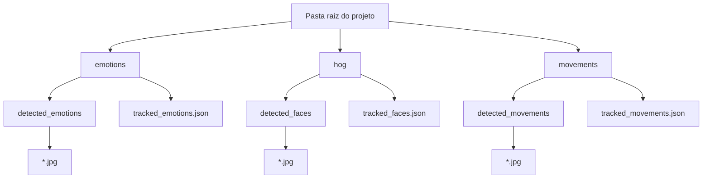
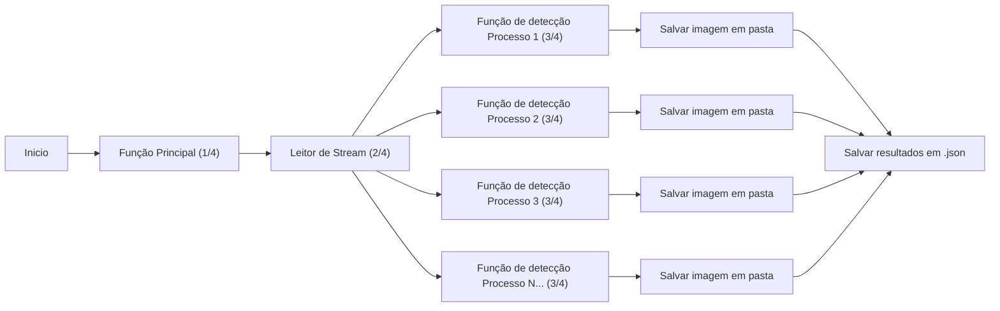

# **Detecção de Rosto, Expressões Faciais e Movimentos Corporais**

---
title: Problema
color: dark
layout: section
---

# **Problema**

---
layout: two-cols
---

:: left ::

# Problema

Usando o vídeo fornecido como base, é esperado que sejam realizados os seguintes processos:
- Reconhecimento facial: Identifique e marque os rostos presentes no vídeo.
- Análise de expressões emocionais: Analise as expressões emocionais dos rostos identificados.
- Detecção de atividades: Detecte e categorize as atividades sendo realizadas no vídeo.
- Geração de resumo: Crie um resumo automático das principais atividades e emoções detectadas no vídeo.

:: right ::

<SlidevVideo autoplay muted timestamp=0>
   <source src="./input.mp4" type="video/mp4" />
</SlidevVideo>

---
layout: section
color: dark
---

# **Instalação de Pacotes**

---

# **Instalação de Pacotes**

- É configurado um ambiente virtual

```sh
python -m venv venv   # Caso queira instalar em um ambiente virtual
./venv/bin/activate   # Caso usar Windows, usar .\venv\Scripts\activate
```
<v-click>

- Depois são instaladas as dependências do projeto.

```sh
pip install deepface mediapipe face-recognition

# Tive problemas com a biblioteca 'dlib', então tive que baixar binário por fora
# Usei executável para Python 3.10 desse repositório
# https://github.com/z-mahmud22/Dlib_Windows_Python3.x

# Depois de baixado, instalei apontando para o arquivo baixado localmente
# pip install ./<nome do arquivo dlib-versao.whl>
# pip install tf-keras
```
</v-click>

---
layout: section
color: dark
---

# **Definições Iniciais**

---

# **Definições Iniciais**

- Para os resultados das detecções, estas serão salvas na seguinte estrutura:



---
layout: section
color: dark
---

# **Solução**

---

# **Solução**

1. `00_face_detection.py`

   Executa a detecção de rostos e gera a pasta `/hog`.

   Levou ~136.830 segundos para executar.

<v-click>

2. `01_emotion_detection.py`

   Executa a detecção de emoções e gera a pasta `/emotions`.

   Levou ~237.782 segundos para executar.

</v-click>

<v-click>

3. `02_movement_detection.py`

   Executa a detecção de movimentos corporais e gera a pasta `/movements`.

   Levou ~41.261 segundos para executar.

</v-click>

<v-click>

4. `03_auto_summary.py`

   Coleta os arquivos `.json` gerados nas execuções anteriores e gera um relatório, enquanto imprime no terminal.

</v-click>

---
layout: section
color: dark
---

# **Lógica**

---

# **Lógica**

- Para os arquivos `00_face_detection.py`, `01_emotion_detection.py`, e `02_movement_detection.py`, estes possuem código semelhante. O que os diferencia são os nomes dos arquivos e pastas geradas e as funções de detecção.
- Com isso, o fluxo de cada arquivo pode ser resumido nos seguintes passos:



---

# **Função Principal (1/4)**

- Esta função é a que chama o arquivo de vídeo, executa através de uma função que permite disponibilizar o vídeo como stream, que então processa cada frame do vídeo e depois salva os resultados coletados em um `.json`.

````md magic-move
```py {1-6}
def track_func(video_source: str) -> Dict[int, List[str]]:
    data = {}
    # Abre o video com o leitor de stream, que inicia vários processos
    for i, detected_content in enumerate(
        stream_reader(video_source=video_source),
    ):
        if not detected_content:
            continue
        data[i] = detected_content

    save_to_json(
        data=data,
        filename=os.path.join(BASE_DIR, OUTPUT_FILE),
    )
    return data
```

```py {1-2,7-10}
def track_func(video_source: str) -> Dict[int, List[str]]:
    data = {}
    # Abre o video com o leitor de stream, que inicia vários processos
    for i, detected_content in enumerate(
        stream_reader(video_source=video_source),
    ):
        # Depois de obter o resultado, salva o frame e o que foi detectado
        if not detected_content:
            continue
        data[i] = detected_content

    save_to_json(
        data=data,
        filename=os.path.join(BASE_DIR, OUTPUT_FILE),
    )
    return data
```

```py {12-17}
def track_func(video_source: str) -> Dict[int, List[str]]:
    data = {}
    # Abre o video com o leitor de stream, que inicia vários processos
    for i, detected_content in enumerate(
        stream_reader(video_source=video_source),
    ):
        # Depois de obter o resultado, salva o frame e o que foi detectado
        if not detected_content:
            continue
        data[i] = detected_content

    # Após terminar o loop, salva os resultados com os frames em um .json
    save_to_json(
        data=data,
        filename=os.path.join(BASE_DIR, OUTPUT_FILE),
    )
    return data
```
````

---

# **Leitor de Stream (2/4)**

- Além de ser uma função que disponibiliza os frames do vídeo passado como um gerador, ele também repassa as tarefas para múltiplos processos executarem em paralelo.

````md magic-move
```py {1-8,18}
def stream_reader(video_source: str) -> Iterable[List[str]]:
   # Ler o vídeo
   cap = cv2.VideoCapture(video_source)
   if not cap.isOpened():
      return

   total_frames = int(cap.get(cv2.CAP_PROP_FRAME_COUNT))
   frame_iterator = tqdm(range(min(total_frames, MAX_COUNT)), desc="Detecting faces")

   with ProcessPoolExecutor(max_workers=MAX_WORKERS) as executor:
      futures = [
         executor.submit(process_frame, cap.read()[1], i)
         for i in frame_iterator
         if cap.read()[0]
      ]
      for future in tqdm(futures, desc="Processing frames"):
         yield future.result()
   cap.release()
```
```py {10-16}
def stream_reader(video_source: str) -> Iterable[List[str]]:
   # Ler o vídeo
   cap = cv2.VideoCapture(video_source)
   if not cap.isOpened():
      return

   total_frames = int(cap.get(cv2.CAP_PROP_FRAME_COUNT))
   frame_iterator = tqdm(range(min(total_frames, MAX_COUNT)), desc="Detecting faces")

   # Inicia vários processos, para executar a função de detecção em paralelo
   with ProcessPoolExecutor(max_workers=MAX_WORKERS) as executor:
      futures = [
         executor.submit(process_frame, cap.read()[1], i)
         for i in frame_iterator
         if cap.read()[0]
      ]
      for future in tqdm(futures, desc="Processing frames"):
         yield future.result()
   cap.release()
```
```py {17-19}
def stream_reader(video_source: str) -> Iterable[List[str]]:
   # Ler o vídeo
   cap = cv2.VideoCapture(video_source)
   if not cap.isOpened():
      return

   total_frames = int(cap.get(cv2.CAP_PROP_FRAME_COUNT))
   frame_iterator = tqdm(range(min(total_frames, MAX_COUNT)), desc="Detecting faces")

   # Inicia vários processos, para executar a função de detecção em paralelo
   with ProcessPoolExecutor(max_workers=MAX_WORKERS) as executor:
      futures = [
         executor.submit(process_frame, cap.read()[1], i)
         for i in frame_iterator
         if cap.read()[0]
      ]
      # Retorna resultados por chamada do gerador
      for future in tqdm(futures, desc="Processing frames"):
         yield future.result()
   cap.release()
```
````

---

# **Função de Detecção (3/4)**

- Usa o frame, converte de BGR para RGB, passa para a biblioteca de detecção, obtém as coordenadas e informações necessárias, salva a imagem detectada, e retorna

````md magic-move
```py {1-11}
def process_frame(
   frame: np.ndarray,
   frame_index: int,
) -> List[dict[str, float]]:
   # Usuário pode redimensionar o frame caso queira experimentar por questões de performance
   small_frame = cv2.resize(
      frame,
      (0, 0),
      fx=FRAME_RESIZE_FACTOR,
      fy=FRAME_RESIZE_FACTOR,
   )
   rgb_frame = cv2.cvtColor(small_frame, cv2.COLOR_BGR2RGB)
   face_locations = face_recognition.face_locations(rgb_frame, model="hog")

   detected_faces = []
   for loc in face_locations:
      top, right, bottom, left = loc
      face_str = f"frame{frame_index:04d}_top{top:.3f}_right{right:.3f}_bottom{bottom:.3f}_left{left:.3f}"
      detected_faces.append(
         {
            "TOP": top,
            "RIGHT": right,
            "BOTTOM": bottom,
            "LEFT": left,
         }
      )
      face_img = rgb_frame[top:bottom, left:right]

      face_filename = os.path.join(BASE_DIR, OUTPUT_DIR, f"{face_str}.jpg")
      cv2.imwrite(face_filename, cv2.cvtColor(face_img, cv2.COLOR_RGB2BGR))

   return detected_faces
```
```py {8-10}
def process_frame(
   frame: np.ndarray,
   frame_index: int,
) -> List[dict[str, float]]:
   # Usuário pode redimensionar o frame caso queira experimentar por questões de performance
   small_frame = cv2.resize(frame, (0, 0), fx=FRAME_RESIZE_FACTOR, fy=FRAME_RESIZE_FACTOR)

   # Converte de BGR para RGB
   rgb_frame = cv2.cvtColor(small_frame, cv2.COLOR_BGR2RGB)
   face_locations = face_recognition.face_locations(rgb_frame, model="hog")

   detected_faces = []
   for loc in face_locations:
      top, right, bottom, left = loc
      face_str = f"frame{frame_index:04d}_top{top:.3f}_right{right:.3f}_bottom{bottom:.3f}_left{left:.3f}"
      detected_faces.append(
         {
            "TOP": top,
            "RIGHT": right,
            "BOTTOM": bottom,
            "LEFT": left,
         }
      )
      face_img = rgb_frame[top:bottom, left:right]

      face_filename = os.path.join(BASE_DIR, OUTPUT_DIR, f"{face_str}.jpg")
      cv2.imwrite(face_filename, cv2.cvtColor(face_img, cv2.COLOR_RGB2BGR))

   return detected_faces
```
```py {10-12}
def process_frame(
   frame: np.ndarray,
   frame_index: int,
) -> List[dict[str, float]]:
   # Usuário pode redimensionar o frame caso queira experimentar por questões de performance
   small_frame = cv2.resize(frame, (0, 0), fx=FRAME_RESIZE_FACTOR, fy=FRAME_RESIZE_FACTOR)

   # Converte de BGR para RGB
   rgb_frame = cv2.cvtColor(small_frame, cv2.COLOR_BGR2RGB)

   # Executa a função de detecção (nesse caso, é a de localizar rostos com a biblioteca 'face-recognition')
   face_locations = face_recognition.face_locations(rgb_frame, model="hog")

   detected_faces = []
   for loc in face_locations:
      top, right, bottom, left = loc
      face_str = f"frame{frame_index:04d}_top{top:.3f}_right{right:.3f}_bottom{bottom:.3f}_left{left:.3f}"
      detected_faces.append(
         {
            "TOP": top,
            "RIGHT": right,
            "BOTTOM": bottom,
            "LEFT": left,
         }
      )
      face_img = rgb_frame[top:bottom, left:right]

      face_filename = os.path.join(BASE_DIR, OUTPUT_DIR, f"{face_str}.jpg")
      cv2.imwrite(face_filename, cv2.cvtColor(face_img, cv2.COLOR_RGB2BGR))

   return detected_faces
```

```py {6-}
def process_frame(
   frame: np.ndarray,
   frame_index: int,
) -> List[dict[str, float]]:
   # Executa a função de detecção (nesse caso, é a de localizar rostos com a biblioteca 'face-recognition')
   face_locations = face_recognition.face_locations(rgb_frame, model="hog")
   # Para cada resultado, salva as informações e a imagem em sua respectiva pasta (nesse caso, a pasta 'hog/detected_faces')
   detected_faces = []
   for loc in face_locations:
      top, right, bottom, left = loc
      face_str = f"frame{frame_index:04d}_top{top:.3f}_right{right:.3f}_bottom{bottom:.3f}_left{left:.3f}"
      detected_faces.append({
         "TOP": top, "RIGHT": right, "BOTTOM": bottom, "LEFT": left,
      })
      face_img = rgb_frame[top:bottom, left:right]

      face_filename = os.path.join(BASE_DIR, OUTPUT_DIR, f"{face_str}.jpg")
      cv2.imwrite(face_filename, cv2.cvtColor(face_img, cv2.COLOR_RGB2BGR))

   return detected_faces
```
````

---

# **Salvar em .json (4/4)**

- Uma simples função utilitária para salvar o dicionário do Python em um arquivo `.json`.

```py
def save_to_json(data: Dict[int, List[str]], filename: str) -> None:
   # Função para salvar os dados em JSON
   with tqdm(total=1, desc="Saving JSON") as pbar:
      with open(filename, "w") as f:
         json.dump(data, f)
      pbar.update(1)
```

---
layout: section
color: dark
---

# **Relatório**

---

# **Relatório**

- Para que não fosse considerado uma anomalia, cada frame foi verificado se possuía a localização da face, uma emoção predominante, e se possuia os landmarks do rosto*

> *Landmarks do rosto foram definidos como contendo todos os seguintes pontos:
> - olho esquerdo
> - olho direito
> - nariz
> - lábio esquerdo
> - lábio direito

---

# **Relatório**

- O ideal é que seja executado para comprovar que o relatório foi, de fato, gerado conforme o vídeo fornecido, mas estes foram os valores obtidos:

| **GENERAL** |
| - |
| 607 frames |
| 713 face anomalies |
| 0 emotion anomalies |
| 2006 movement anomalies |

> Foi verificado se haviam os *landmarks* do rosto, emoções, e rosto.

<br/>

> Cada frame é considerado com limite de 1 anomalia, então mesmo que tenha todos esses pontos faltando, vai representar apenas 1 neste indicador

---

# **Relatório**

| **FACES** |
| - |
| Total of 610 faces |

---

# **Relatório**

| **EMOTIONS** |  |
| - | - |
| 226 | <mark class="green">happy</mark> |
| 212 | <mark class="gray">neutral</mark> |
| 101 | <mark>fear</mark> |
| 75 | <mark class="blue">sad</mark> |
| 66 | <mark class="purple">surprise</mark> |
| 11 | <mark class="red">angry</mark> |
| Total of 691 emotions |

<style>
   mark.gray {
      --uno: "bg-gray-500 text-white";
   }
   mark.purple {
      --uno: "bg-purple-500 text-white";
   }
   mark.green {
      --uno: "bg-green-500 text-white";
   }
   mark.red {
      --uno: "bg-red-500 text-white";
   }
   mark.blue {
      --uno: "bg-blue-800 text-white";
   }
</style>

---

# **Relatório**

| **MOVEMENTS** |
| - |
| 29 <mark>arms_up</mark> movements |
| 301 <mark>sideways</mark> movements |
| Total of 9829 landmarks detected |