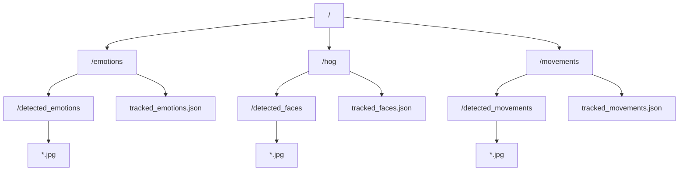

# **Detecção de Rosto, Expressões Faciais e Movimentos Corporais**

---
title: Problema
color: dark
layout: section
---

# **Problema**

---
layout: two-cols
---

:: left ::

# Problema

Usando o vídeo fornecido como base, é esperado que sejam realizados os seguintes processos:
- Reconhecimento facial: Identifique e marque os rostos presentes no vídeo.
- Análise de expressões emocionais: Analise as expressões emocionais dos rostos identificados.
- Detecção de atividades: Detecte e categorize as atividades sendo realizadas no vídeo.
- Geração de resumo: Crie um resumo automático das principais atividades e emoções detectadas no vídeo.

:: right ::

<SlidevVideo autoplay muted timestamp=0>
   <source src="./input.mp4" type="video/mp4" />
</SlidevVideo>

---
layout: section
color: dark
---

# **Instalação de Pacotes**

---

# **Instalação de Pacotes**

- É configurado um ambiente virtual, depois são instaladas as dependências do projeto.

````md magic-move
```sh
python -m venv venv   # Caso queira instalar em um ambiente virtual
./venv/bin/activate   # Caso usar Windows, usar .\venv\Scripts\activate
```
```sh
pip install deepface mediapipe face-recognition

# Tive problemas com a biblioteca 'dlib', então tive que baixar binário por fora
# Usei executável para Python 3.10 desse repositório
# https://github.com/z-mahmud22/Dlib_Windows_Python3.x

# Depois de baixado, instalei apontando para o arquivo baixado localmente
# pip install ./<nome do arquivo dlib-versao.whl>
# pip install tf-keras
```
````

---
layout: section
color: dark
---

# **Definições Iniciais**

---

# **Definições Iniciais**

- Para os resultados das detecções, estas serão salvas na seguinte estrutura:



---
layout: section
color: dark
---

# **Solução**

---

# **Solução**

1. Executa a detecção de rostos e gera a pasta `/hog`.

   Levou ~136.830 segundos para executar.

2. Executa a detecção de emoções e gera a pasta `/emotions`.

   Levou ~237.782 segundos para executar.

3. Executa a detecção de movimentos corporais e gera a pasta `/movements`.

   Levou ~41.261 segundos para executar.

4. Coleta os arquivos `.json` gerados nas execuções anteriores e gera um relatório, enquanto imprime no terminal.

---
layout: section
color: dark
---

# **Lógica**

---

# **Lógica**

- Para os arquivos `00_face_detection.py`, `01_emotion_detection.py`, e `02_movement_detection.py`, estes possuem código semelhante. O que os diferencia são os nomes dos arquivos e pastas geradas e as funções de detecção.
- Com isso, o fluxo de cada arquivo pode ser resumido nos seguintes passos:

---

# **Função Principal (1/4)**

- Esta função é a que chama o arquivo de vídeo, executa através de uma função que permite disponibilizar o vídeo como stream, que então processa cada frame do vídeo e depois salva os resultados coletados em um `.json`.

---

# **Leitor de Stream (2/4)**

- Além de ser uma função que disponibiliza os frames do vídeo passado como um gerador, ele também repassa as tarefas para múltiplos processos executarem em paralelo.

---

# **Função de Detecção (3/4)**

- Esta função varia ao longo dos arquivos mencionados anteriormente, mas consiste em obter o frame do vídeo, converter a cor do formato que o OpenCV2 usa (BGR) para (RGB).
- Então é passado para a biblioteca de detecção, que retorna algumas informações e as coordenadas da detecção caso esta tenha sido sucedida.
- Após tal passo, é salvo a imagem detectada na respectiva pasta definida em cada arquivo.
- Depois disso, retorna estes valores.

---

# **Salvar em .json (4/4)**

- Uma simples função utilitária para salvar o dicionário do Python em um arquivo `.json`.

---
layout: section
color: dark
---

# **Relatório**

---

# **Relatório**

- Para que não fosse considerado uma anomalia, cada frame foi verificado se possuía a localização da face, uma emoção predominante, e se possuia os landmarks do rosto*

> *Landmarks do rosto foram definidos como contendo todos os seguintes pontos:
> - olho esquerdo
> - olho direito
> - nariz
> - lábio esquerdo
> - lábio direito

---

# **Relatório**

- O ideal é que seja executado para comprovar que o relatório foi, de fato, gerado conforme o vídeo fornecido, mas estes foram os valores obtidos:

---

| **GENERAL** |
| - |
| 607 frames |
| 713 face anomalies |
| 0 emotion anomalies |
| 2006 movement anomalies |

> Foi verificado se haviam os *landmarks* do rosto, emoções, e rosto.

<br/>

> Cada frame é considerado com limite de 1 anomalia, então mesmo que tenha todos esses pontos faltando, vai representar apenas 1 neste indicador

---

| **FACES** |
| - |
| Total of 610 faces |

---

| **EMOTIONS** |  |
| - | - |
| 226 | <mark class="green">happy</mark> |
| 212 | <mark class="gray">neutral</mark> |
| 101 | <mark>fear</mark> |
| 75 | <mark class="blue">sad</mark> |
| 66 | <mark class="purple">surprise</mark> |
| 11 | <mark class="red">angry</mark> |
| Total of 691 emotions |

<style>
   mark.gray {
      --uno: "bg-gray-500 text-white";
   }
   mark.purple {
      --uno: "bg-purple-500 text-white";
   }
   mark.green {
      --uno: "bg-green-500 text-white";
   }
   mark.red {
      --uno: "bg-red-500 text-white";
   }
   mark.blue {
      --uno: "bg-blue-800 text-white";
   }
</style>

---

| **MOVEMENTS** |
| - |
| 29 <mark>arms_up</mark> movements |
| 301 <mark>sideways</mark> movements |
| Total of 9829 landmarks detected |